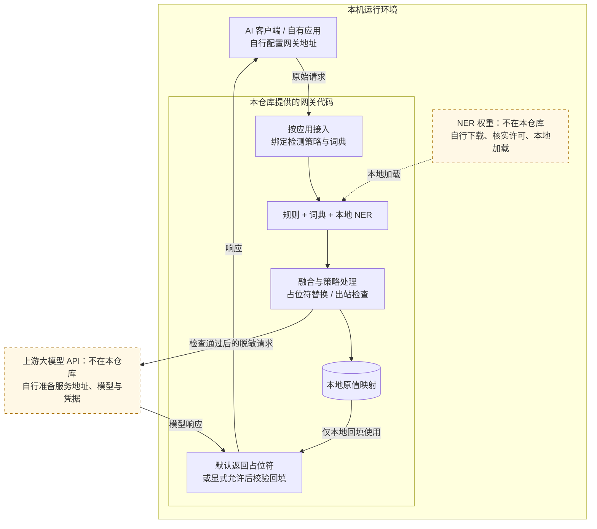

# 脱敏网关

本地敏感信息检测、规则与词典脱敏、占位符映射和严格回填的开源参考实现。

**这是供研究与自行部署的源码版。最小示例不需要外部模型，不调用云端服务，不需要 API Key 或激活码。完整模型检测、PDF 解析、外部应用接入则需要额外准备，不能把最小示例的成功等同于完整系统已就绪。**

## 作为本地 AI 网关使用

支持自定义 API 地址的应用，可以将兼容请求先交给本机脱敏网关：本地规则、词典和 NER 共同检测，按应用策略替换敏感值，再转发到配置好的上游模型服务。原值映射留在本地；响应默认保留占位符，也可为受信任的本地应用显式启用自动回填。



图示为准备好 NER 后的网关能力；本仓库提供加载代码，不包含权重。上游身份验证凭据仍需传给对应服务，不能把“文本脱敏”理解为所有请求字段都被隐藏。未通过必要检测或出站检查的请求会被阻断；检测覆盖本身不等于零漏检。

例如，OpenAI Chat Completions 兼容客户端可将 Base URL 设为 `http://127.0.0.1:8765/apps/gateway_demo/v1`。该地址需先注册应用、配置上游并准备本地检测器；当前不是通用协议转换器，也不自动代理应用的其他网络请求。

详细配置、两种响应模式和接口边界见 [网关接入说明](docs/GATEWAY.md)。

## 用图理解完整设计

这些图描述公开源码已经实现的处理路径，并把额外依赖、配置条件和失败分支一起画出。完整 NER 路径需要另行准备权重；图示不是本次已经完成模型联调或准确率验证的证明。

| 想了解什么 | 图文入口 |
| --- | --- |
| 为什么采用本地脱敏与可信回填、有哪些功能 | [设计思路、数据边界和功能总览](docs/DESIGN.md) |
| 各层怎样协作，规则、词典、NER 如何融合 | [技术架构、检测流水线和 NER 实现](docs/ARCHITECTURE.md) |
| 文本、文件、回答和长期上下文分别怎样处理 | [工作流程、回填决策和映射生命周期](docs/WORKFLOWS.md) |
| 客户端怎样配置网关，请求和响应怎样转发 | [网关配置关系和请求时序](docs/GATEWAY.md) |

## 先跑通一个不依赖模型的示例

需要 Python 3.10 或更新版本。首次安装需要获取普通 Python 依赖；安装完成后，示例运行不联网。

```bash
git clone https://github.com/Doubixilin/tuomin-open-source.git
cd tuomin-open-source
python -m venv .venv
```

macOS / Linux 激活环境：`source .venv/bin/activate`；Windows PowerShell：`.venv\Scripts\Activate.ps1`。

```bash
python -m pip install .
python examples/minimal_demo.py
```

示例只处理代码内明确标注的合成文本，展示“规则＋词典识别 → 占位符脱敏 → 本地回填 → 拒绝未知占位符”。映射只放在进程内存中，不落盘，不读取你的文档或配置，不访问钥匙串，不加载 NER 模型。成功时会输出 `示例验证通过`。

这个例子验证的是**流程和占位符完整性**。它无法据此证明：任意姓名都能被识别、真实合同没有漏检、图片已脱敏、文件内嵌对象已处理，或者发给模型的文本一定安全。规则只能识别覆盖到的格式，词典只能识别已声明的实体。

## 公开版包含什么

| 能力 | 状态和前提 |
| --- | --- |
| 规则检测、词典匹配、重叠合并、脱敏与严格回填 | 最小示例可直接研究，无模型 |
| 会话稳定占位符、命名空间、审计、映射保护、权限控制 | 提供实现与合成测试；部署前按场景配置 |
| 本地 HTTP API 与 Web 控制台 | 安装 `.[serve]` 并准备应用配置 |
| TXT / DOCX / 表格处理 | 提供实现；表格依赖 `.[document]`；旧 DOC 转换依赖 macOS 系统工具 |
| PDF 原生文字提取 | 单独安装 `.[pdf]`，先阅读 PyMuPDF 许可；不提供 OCR |
| 本地中文 NER | 仅提供接入代码；模型权重不随仓库提供，需自行核实许可和准备 |
| MCP、模型代理、外部应用适配 | 提供代码供研究，须自行配置服务地址、Token、上游和应用策略；最小示例不会启用 |
| 桌面安装包、模型全集、自动部署 | 首版不提供 |

## 可选：本地服务

```bash
python -m pip install '.[serve,document]'
```

将 `tuomin_apps.example.json` 复制为 `tuomin_apps.json`，然后：

```bash
tuomin-gateway serve --host 127.0.0.1 --port 8765
```

访问启动日志给出的 `/ui/` 地址。日志会说明管理 Token 文件的位置；不要把 Token 提交到仓库。管理 Token 是访问控制凭据，与 MIT 许可证、可选激活机制不是一回事。社区源码正常运行无需激活。

示例配置中的 `research_demo` 明确关闭 NER，只适合合成流程演示。界面里的其他预设可能要求 NER；未准备模型时应查看 `/readiness` 和降级／阻断提示，不要为了通过检查而关闭真实业务需要的检测器。当前全局 `/readiness` 还会检查未注册请求的 strict 默认策略，因此无模型时返回 503 是预期行为，即使显式配置的无模型合成应用仍能运行。`/healthz` 仅表示进程存活。

macOS 服务映射默认使用钥匙串支持的加密，Windows 使用 DPAPI；Linux 当前存在明文开发存储路径，不能宣称三端都默认加密。离线 CLI 导出的映射也是含原值的明文文件。不要上传映射、原始输入或恢复材料。详见 [安全边界](docs/BOUNDARIES.md)。

## 阅读路线与外部资源

- [设计思路、功能总览与数据边界](docs/DESIGN.md)
- [技术架构与代码入口](docs/ARCHITECTURE.md)
- [文本、文件、回填与映射工作流程](docs/WORKFLOWS.md)
- [作为本地 AI 网关使用：配置与请求流程](docs/GATEWAY.md)
- [模型与第三方资源索引、准备方法](docs/EXTERNAL_RESOURCES.md)
- [能力范围和安全边界](docs/BOUNDARIES.md)
- [第三方许可说明](THIRD_PARTY_NOTICES.md)
- [贡献与后续更新](CONTRIBUTING.md)
- [版本记录](CHANGELOG.md)

公开样例不包含实际业务材料。回归测试中使用的姓名、号码和组织字符串仅用于构造检测场景，不用于联系或识别现实中的个人；不要用演示词典代替自己的受控业务词典。

## 测试

```bash
python -m pip install '.[dev]'
python -m pytest -q
```

测试使用临时目录和合成数据，不要求下载模型。PDF 测试在未安装 PyMuPDF 时跳过；如接受其许可并需要验证 PDF，可以安装 `.[pdf]` 后重跑。平台专属测试在不适用的平台跳过。首次版本的具体验证范围见 [验证记录](docs/VALIDATION.md)。

## 许可证

本仓库中由作者拥有权利的代码和文档采用 [MIT](LICENSE)。第三方依赖、模型和数据适用各自条款；本项目的 MIT 不会替它们重新授权。尤其 PyMuPDF 的组合使用／分发须另行满足 AGPL 或有效商业授权条件，见 [第三方许可说明](THIRD_PARTY_NOTICES.md)。

你可以研究、修改和复用代码。请不要把它描述为“零泄漏”“所有文件均可安全上传”或已经完成生产安全认证的产品。
