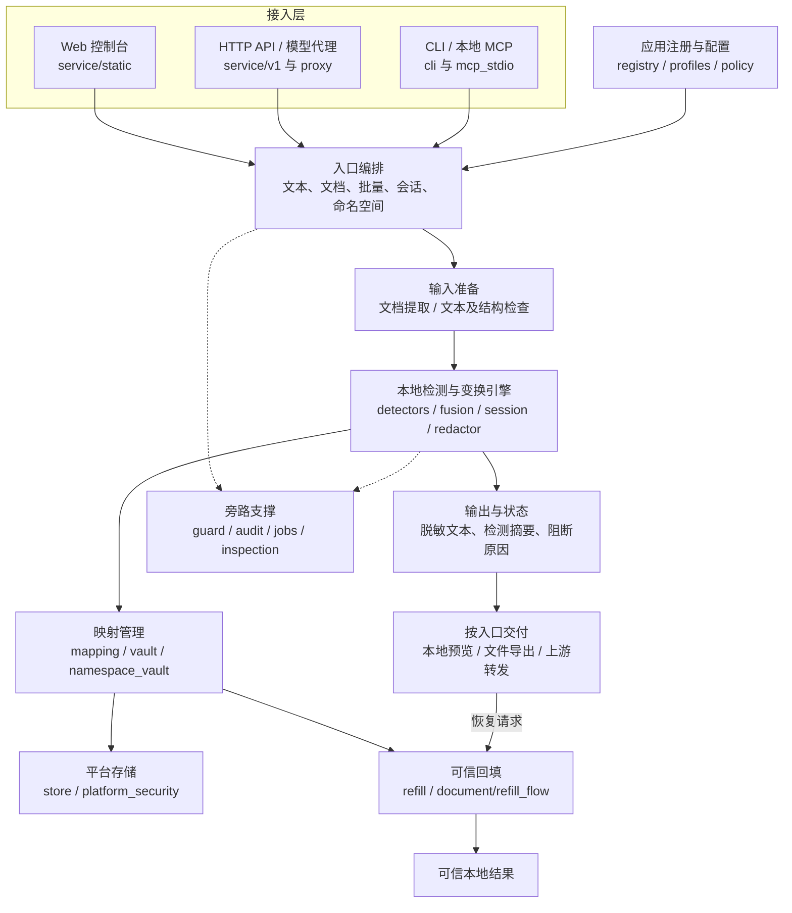
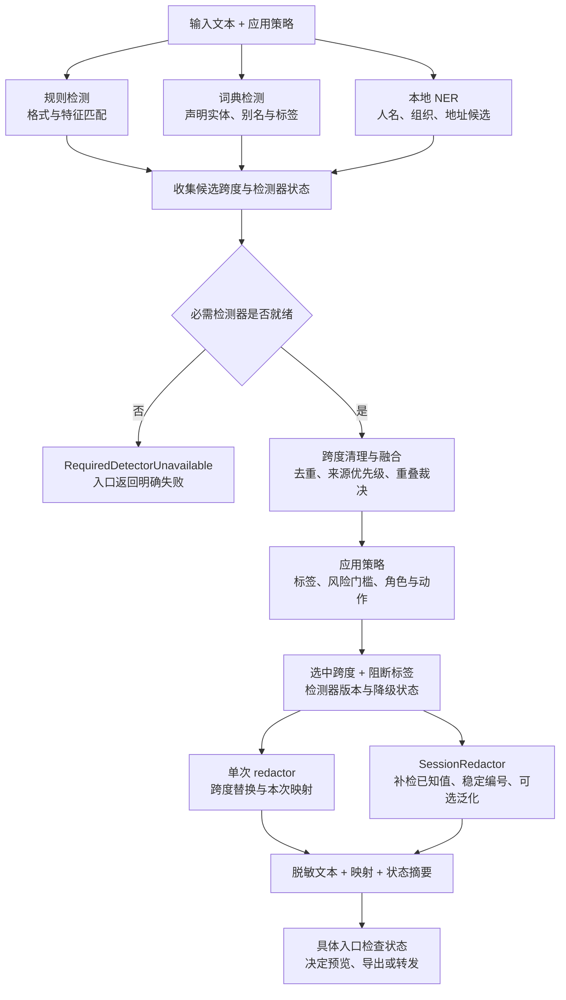
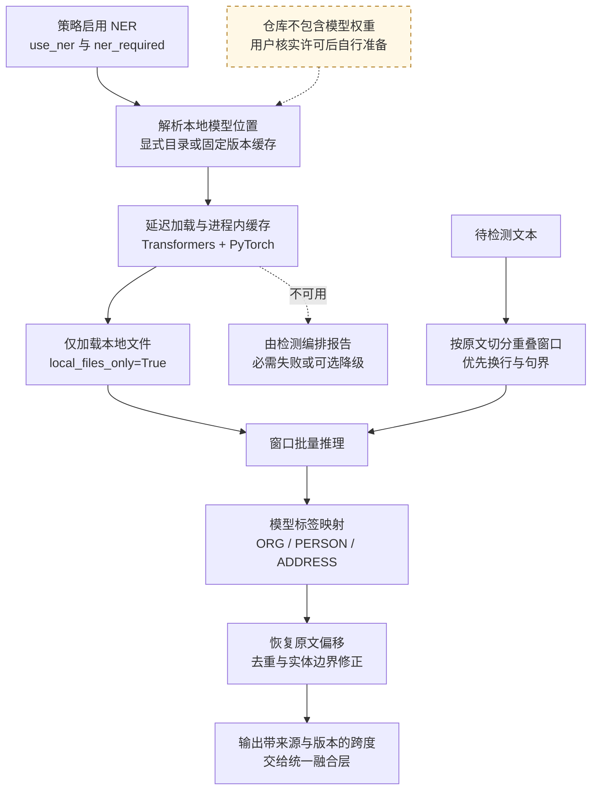

# 技术架构与代码入口

本文对应公开源码的现有结构。图中的箭头表示主要调用或数据依赖，不表示组件均为独立服务或并行运行。除单独注明外，模块路径相对 `src/tuomin_gateway/`。

## 1. 分层与职责

这是逻辑分层图：CLI 最小示例可以直接调用核心函数，不经过 HTTP；MCP 适配器通过本地网关 API 调用能力；模型代理在服务进程内使用检测引擎，不为每次脱敏增加一次本地 HTTP 跳转。文件和 API 复用检测与映射机制，但授权、导出限制和回填合同由各自入口处理。

## 2. 检测与脱敏流水线

三种检测来源在逻辑上汇集，当前 `run_detection` 不表示三个独立并行服务。规则和已配置的词典属于必需检测器；NER 是否必需由策略声明。可选 NER 不可用时允许返回明确的降级信息，但文件工作台仍会因降级拒绝出站。API 使用方需要读取返回状态，不能只判断是否拿到了文本。

融合使用候选来源优先级和重叠规则，NER 候选优先级低于精确词典和规则；还包含原文位置、重复跨度和局部语义修正。它不是简单投票，也不能把重叠处理后的跨度完整性等同于敏感信息召回率。

单次脱敏与会话脱敏不是完全相同的路径。会话处理会补检已经拥有的实体值，并在锁内更新映射与编号；检测运行在锁外。别名是否共享身份还取决于身份模式，不能假定所有路径都会自动归一化全部别名。

## 3. NER 本地推理方案

当前适配器面向资源索引中的中文 CLUENER 微调模型：`company / organization / government` 映射为 ORG，`name` 为 PERSON，`address` 为 ADDRESS；其他模型类别不会全部转成隐私类别。它不是通用的多语言敏感内容分类器。

当前窗口参数为 384 字符、相邻重叠 64 字符、每批最多 8 个窗口。目的在于避免长文本超出模型位置限制，并降低切断实体的风险；这些是实现参数，不是准确率或吞吐量承诺。边界扩展、跨行修复和通用词过滤属于启发式处理，仍需结合真实任务评测。

模型权重和依赖许可、文件哈希与本地配置见 [资源索引](EXTERNAL_RESOURCES.md)。预留模型接口不进入这张已实现路径图。

## 4. 授权与接口分层

| 接口族 | 主要约束 | 不应混淆的地方 |
| --- | --- | --- |
| `/api/v1/detect`、`redact`、`refill` 等 | 应用能力与独立能力 Token；回填合同与映射归属 | 获取脱敏能力不等于获取 `trusted_refill` |
| `/api/v1/documents/*` | 管理 Token、任务／恢复材料、工作台专用检查 | 使用 `/api/v1` 前缀不表示与文本 API 的授权方式相同 |
| `/admin/*` | 管理 Token 与本机 Host 检查 | 管理 Token 不是上游模型凭据 |
| `/apps/{app_id}/...` 代理 | 本机信任边界、应用策略；自动回填需要显式允许 | app_id 不构成客户端身份认证 |
| 旧 `/redact`、`/refill`、会话接口 | 兼容路径的自身约束 | 不应将其恢复模型当成 v1 的统一权限合同 |

平台存储：macOS 使用钥匙串支持的 AES-GCM，Windows 使用当前用户 DPAPI，Linux 当前存在明文开发路径；CLI 明文映射导出也需单独保管。本地存储、诊断 trace、可信预览和恢复包不是公开数据，详见 [安全边界](BOUNDARIES.md)。

## 5. 从代码与测试开始阅读

以 `examples/minimal_demo.py` 为起点：

1. `detectors/rules.py` 按格式发现候选值；`detectors/dictionary.py` 匹配声明的实体与别名。
2. `fusion.py` 和 `spans.py` 处理重复与重叠，保留可追踪的跨度。
3. `redactor.py` 将选中的原文跨度替换为占位符；`mapping.py` 管理对应关系。
4. `refill.py` 验证未知、缺失或变形占位符；验证通过才按选定回填合同恢复原值。

以上路径相对 `src/tuomin_gateway/`。原值映射与送给外部模型的脱敏文本有不同的访问边界，不能一起发送。

进一步阅读：

| 模块 | 用途 |
| --- | --- |
| `session.py` | 会话内稳定占位符、检测器就绪与编排 |
| `profiles.py` / `policy.py` | 哪些值脱敏、泛化、阻断或保留 |
| `store.py` / `platform_security.py` | 平台存储保护与文件权限 |
| `vault.py` / `namespace_vault.py` | 不透明映射句柄、命名空间和可信恢复 |
| `service/v1.py` | 带能力权限的 API |
| `service/proxy.py` | 经显式配置的上游代理 |
| `document/` / `service/v1_documents.py` | 文档解析、工作台与恢复流程 |
| `mcp_stdio.py` | MCP 接入边界 |
| `guard/` / `audit.py` | 注入与秘密模式检测、安全审计摘要 |
| `licensing/` | 可选离线授权机制研究；社区运行默认关闭且不包含发行身份 |

接口分层：优先研究 `/api/v1`；旧 `/redact`、`/refill` 和会话接口为兼容路径。不要把旧接口的回填约束当成所有接口的统一权限模型。

本公开版不提供包含模型权重的桌面分发流程，也不为历史评测结果背书。应按自己的输入、配置与版本重新验证。

测试入口位于仓库根目录 `tests/`，包括 `test_proxy.py`、`test_documents_api.py`、`test_public_example.py` 等。模拟检测器或上游的回归验证接口和处理逻辑；真实 NER 效果、客户端兼容性与供应商联调需另行验证。
