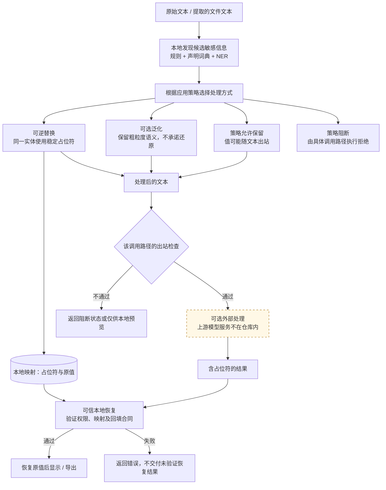
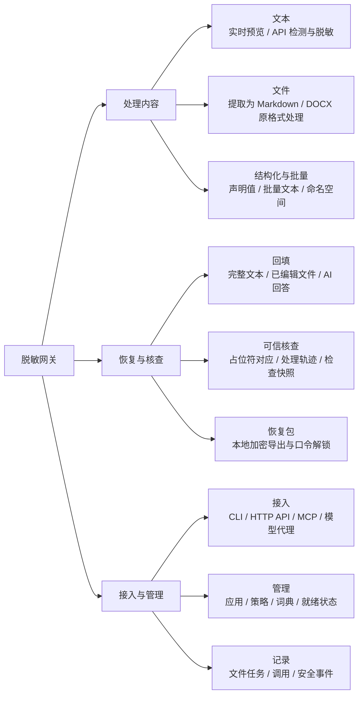

# 设计思路、功能总览与数据边界

阅读顺序：[设计思路](DESIGN.md) → [技术架构](ARCHITECTURE.md) → [工作流程](WORKFLOWS.md) → [网关配置](GATEWAY.md)。

## 1. 目标：在保留文本可用性的同时减少原值暴露

输入中的身份、组织和联系方式等信息，既可能是需要保护的值，也可能参与模型推理。项目用占位符保存这些值之间的引用关系，把原值对应表留在本地，允许在受控的恢复路径中还原。

这依赖两种不同的能力：先发现应处理的信息，再确保占位符与原值的对应关系可控。后者校验通过，并不能证明前者没有漏检；两者必须分别验证。

这里的“出站检查”是概念位置，不代表所有 API 使用同一个实现。核心 API 会返回处理状态供调用方判断，文件工作台另有更严格的导出检查，代理路径直接控制是否发起上游调用。不能看到一段脱敏输出就忽略其 `egress_allowed`、检测器状态和阻断原因。

## 2. 功能总览：按使用目标组织

| 功能 | 输入和输出 | 实现条件及限制 |
| --- | --- | --- |
| 实时文本预览 | 文本 → 高亮对照、占位符、检测摘要 | 预览接口不保存映射，不代表已经发送到模型 |
| 文本 API | 文本 → 检测结果或脱敏文本、映射句柄和状态 | v1 能力权限由应用注册配置；调用方必须检查阻断状态 |
| 文件工作台 | 支持的文件 → Markdown、恢复包、处理记录 | 原文件不被覆盖；提取能力、检测器和导出检查共同决定可用范围 |
| DOCX 原格式处理 | DOCX → 新的脱敏或恢复 DOCX | 对支持的 XML 文本部位执行替换；不支持的嵌入对象等有专门检查，不能据此宣称任意 DOCX 内容都可处理 |
| AI 回答回填 | 回答与恢复材料 → 恢复文本或阻断结果 | 可引用原映射的子集或重复引用；未知、变形占位符会被拒绝 |
| 会话与命名空间 | 多段输入 → 作用域内稳定占位符 | 文档、会话、命名空间作用域不同；不跨任意应用自动共享映射 |
| 可信预览 | 受控恢复材料 → 本地对照和核查信息 | 解锁后的原值仍是敏感内容，不能用于公开截图 |
| 网关代理 | 兼容模型请求 → 脱敏转发与受控返回 | 仅覆盖经过本网关的请求，客户端、上游地址和凭据需自行配置 |
| MCP 接入 | 本地工具调用 → 网关检测与脱敏结果 | 通用 MCP 适配器只暴露低权限工具，不等同于授予任意原值恢复权限 |

## 3. 关键设计选择与代价

| 设计选择 | 解决的问题 | 需要承担的约束 |
| --- | --- | --- |
| 规则、词典与 NER 组合 | 兼顾结构化格式、明确已知实体和开放文本实体 | NER 仍会误检漏检；词典质量和策略必须维护 |
| 同一作用域内稳定占位符 | 多次提及同一实体时保留引用关系 | 必须管理作用域、并发更新和生命周期 |
| 检测策略与回填合同分开 | “哪些值处理”与“怎样允许恢复”可独立配置 | 完整转换和聊天回答不能简单复用同一个完整性要求 |
| 原值映射留在本地 | 避免为外部处理直接提供原值对应表 | 本机权限、存储加密、备份和保管仍需单独处理 |
| 必需检测器失败就阻断 | 避免静默使用不完整能力继续运行 | 模型或配置故障会影响可用性，需看 readiness 而非只看 health |
| 独立发布模型索引 | 保留完整技术方案，同时不附带许可未明确的权重 | 使用者需自行准备模型，基础安装不等于完整环境 |

泛化是不可逆的处理方式：成功泛化的值不作为可逆占位符写入普通恢复映射。需要逐字恢复的文件流程应使用可逆策略。用于本地核查的 trace、映射和恢复材料可能包含原值，不能因其属于“诊断数据”就当作公开日志。

## 4. 仓库提供什么，使用者准备什么

| 本仓库提供 | 使用者另行准备 | 当前不应承诺 |
| --- | --- | --- |
| 检测适配、NER 本地加载、融合与脱敏代码 | NER 模型权重和适用许可 | 任意输入都不会漏检 |
| 服务、控制台、API、MCP 与代理实现 | Python 可选依赖、客户端配置 | 所有 AI 客户端和接口协议都兼容 |
| 合成词典与测试 | 经审阅的业务词典与应用策略 | 合成测试等于业务质量验收 |
| 本地映射与平台保护实现 | 安全运行环境与数据保管方案 | 所有平台都默认加密，或可直接公网部署 |
| 文档解析与恢复代码 | PDF 等可选依赖及其许可条件 | 扫描文件 OCR、任意嵌入对象脱敏 |

NER 在本机推理；外部模型服务是后续可选处理方，两者不能画成同一个组件。预留的其他模型适配接口尚未接通运行时，不作为已实现检测器画入主流程。资源名称与下载入口见 [外部资源索引](EXTERNAL_RESOURCES.md)。
