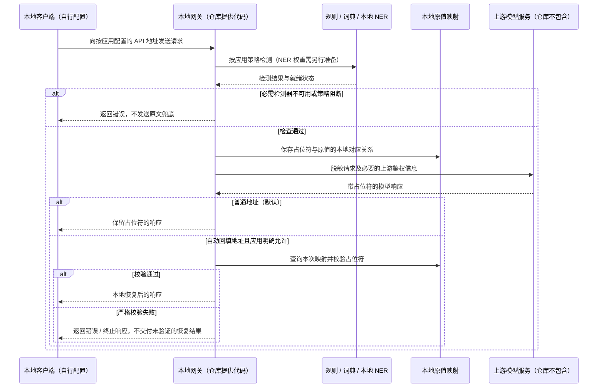

# 作为本地 AI 网关使用

本网关可以放在支持自定义 API 地址的客户端与上游模型之间。客户端把请求发送到本机地址，网关按应用策略运行规则、词典与本地 NER，替换敏感文本，再转发兼容请求。NER 接入代码在本仓库；NER 权重与上游模型服务需要使用者另行准备。

这是一条显式配置的请求路径。应用绕过网关的联网、附件上传、搜索和其他通道不在其自动覆盖范围内。只改变 API 地址也不能证明任意客户端的所有功能都已兼容。

## 请求与响应如何经过网关



图示说明下面这套要求 NER、启用严格回填校验的配置。存储保护随平台不同，不能把“本地映射”视为所有平台都默认加密，详见 [安全边界](BOUNDARIES.md)。出站请求中仍会包含策略允许保留的内容；NER、规则和词典均有覆盖边界。

## 配置示例：先接通保留占位符的模式

以下配置用于说明连接关系。它不会下载模型，不包含有效上游地址、凭据或真实业务词典；替换所需项并验证后才能实际使用。

1. 安装服务与 NER 依赖：`python -m pip install '.[serve,ner]'`。
2. 按 [模型资源索引](EXTERNAL_RESOURCES.md)核实模型许可、准备文件，并将 `TUOMIN_NER_MODEL_DIR` 指向本地模型目录。
3. 在仓库根目录创建自己的 `tuomin_apps.json`。已有配置时只合入新应用，保留原有条目：

```json
{
  "apps": {
    "gateway_demo": {
      "profile": {
        "base": "strict",
        "name": "gateway_ner_demo",
        "use_ner": true,
        "ner_required": true,
        "refill_strict": true
      },
      "dictionary": "tests/fixtures/synthetic_dictionary.json",
      "proxy_upstreams": {
        "openai": "https://provider.example.invalid/v1/chat/completions"
      },
      "allow_auto_refill": false
    }
  }
}
```

`proxy_upstreams.openai` 填完整的上游 Chat Completions 端点，不只是域名或 `/v1` 前缀。示例词典只包含合成条目，实际业务需自行准备与审阅词典。`ner_required: true` 表示缺少必需 NER 时阻断，不会以无模型结果冒充完整检测。

4. 在该目录启动本地服务：`tuomin-gateway serve --host 127.0.0.1 --port 8765`。配置变更后重新启动并验证生效。
5. 在支持 OpenAI Chat Completions 的客户端中填写：

| 配置项 | 填写内容 |
| --- | --- |
| Base URL | `http://127.0.0.1:8765/apps/gateway_demo/v1` |
| 模型名称 | 上游服务实际支持的模型 ID |
| API Key | 上游服务的凭据；网关转发必要的鉴权请求头 |
| 实际请求路径 | `POST /apps/gateway_demo/v1/chat/completions` |

有些客户端要求填写完整端点而非 Base URL，应按其实际拼接方式配置，避免重复 `/v1` 或 `/chat/completions`。图中的客户端和上游 API 都是使用者自己的外部组件。

`TUOMIN_UPSTREAM_OPENAI` 环境变量、客户端的 `x-tuomin-upstream` 请求头也能影响普通应用路由的上游选择。上述例子假设没有这两项覆盖；应用路径绑定策略，不等于上游地址在所有模式下都不可覆盖。开始验证前核对最终目的地址，不要把提供方凭据发送到不受信任的端点。

服务管理 Token 与上游 API Key 用途不同，不要互换。这里介绍的按应用代理地址依赖本机信任边界；应用 ID 不是密码，`allow_auto_refill` 是配置许可，不能当作客户端身份验证。不要直接作为公网或不受信任的多用户网关开放。

## 两种响应模式

| 模式 | 客户端 Base URL | 必要配置与结果 |
| --- | --- | --- |
| 保留占位符 | `http://127.0.0.1:8765/apps/gateway_demo/v1` | 默认方式；模型响应保留占位符，适合核查脱敏效果 |
| 本地自动回填 | `http://127.0.0.1:8765/apps/gateway_demo/auto/v1` | 将应用的 `allow_auto_refill` 显式改为 `true`；保留 `refill_strict: true`；检查通过后向受信任本地客户端返回恢复结果 |

仅修改客户端地址不能开启自动回填；未获应用配置允许时会返回 403。这个严格回填示例适合完整文本转换：回答省略原有占位符也可能被阻断，因此不能直接当作任意多轮聊天的通用配置。日常问答允许只引用部分实体，需要另外评估相应回填合同与接入路径。

自动回填会把原值交给本地客户端，应核对该客户端的保存、同步和后续联网行为。也可以自行开发受权限控制的 `/api/v1` 回填接入，这需要独立配置能力权限与 Token，不属于只填写 Base URL 的方式。

## 接口与验证范围

- 当前代理提供 OpenAI 风格的 `/chat/completions` 和 Anthropic 风格的 `/messages`，支持相关 JSON 与 SSE 路径；两种协议分别转发，不相互转换。
- Anthropic 接入应配置 `proxy_upstreams.anthropic` 为上游完整 Messages 端点，客户端实际请求应落到 `POST /apps/gateway_demo/v1/messages` 或明确允许的 `/auto/v1/messages`。
- 本说明不承诺支持 Responses API、任意多模态内容或客户端所有工具通道。应核对其实际使用的端点与输入结构。
- 启动后检查 `/readiness`，确认 NER 加载与应用配置，再用合成文本核对占位符、返回模式和异常阻断；`/healthz` 成功只表示进程存活。
- 本仓库代理回归测试使用模拟上游验证逻辑，不等同于已验证你的模型、供应商与客户端组合。此文档和图没有宣称已完成真实 NER 或外部服务联调。

实现入口：`src/tuomin_gateway/service/proxy.py`（路由、转发和回填）、`service/registry.py`（应用配置）、`session.py`（检测与会话映射）。后三者的路径均相对 `src/tuomin_gateway/`。完整模块说明见 [架构文档](ARCHITECTURE.md)。
