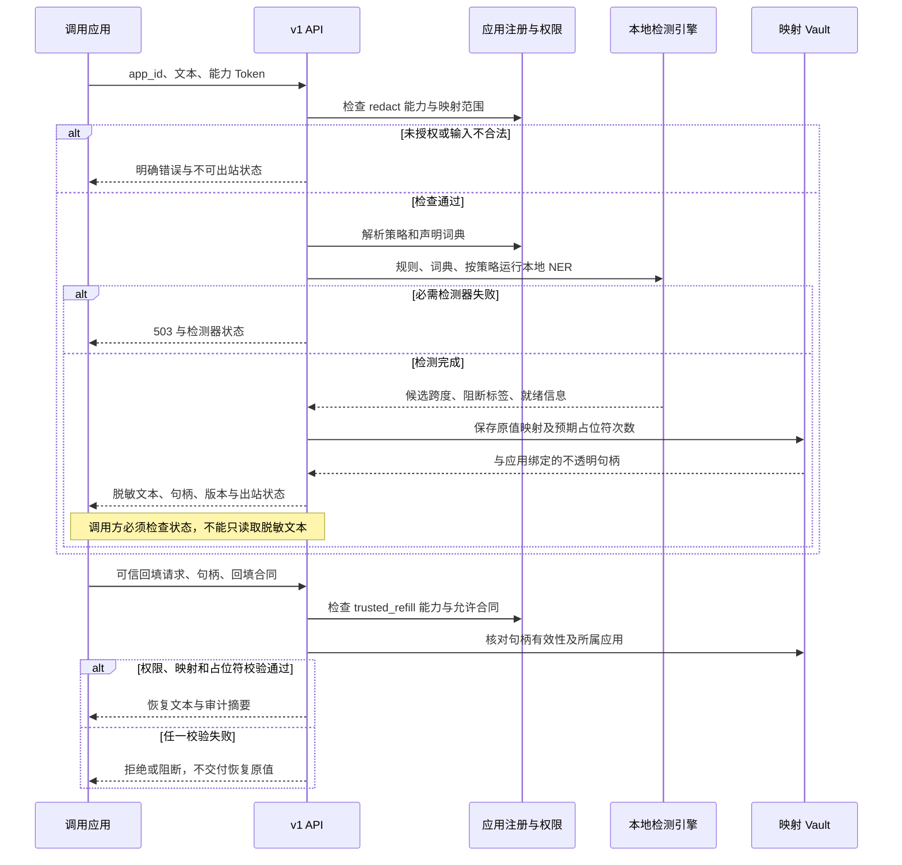
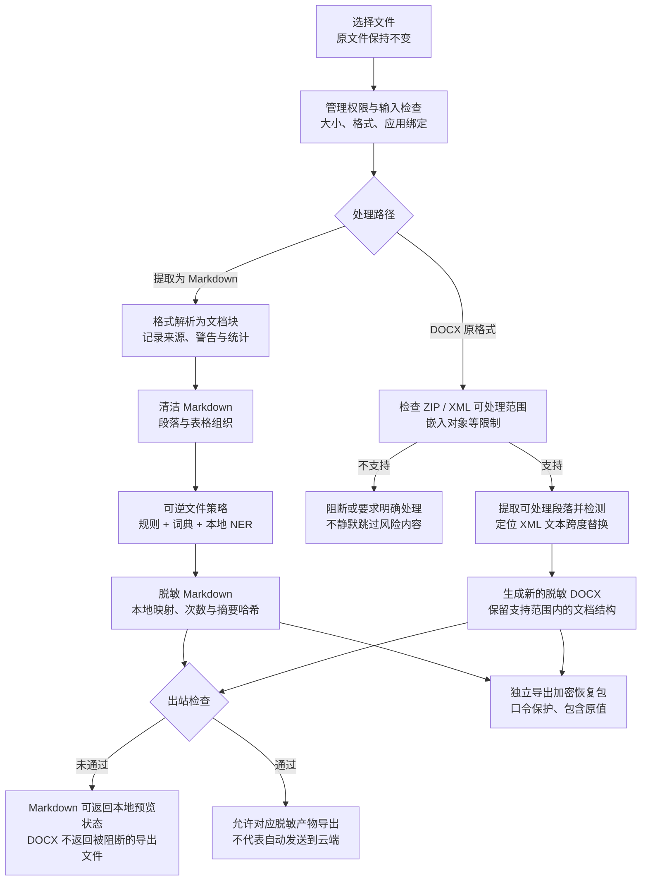
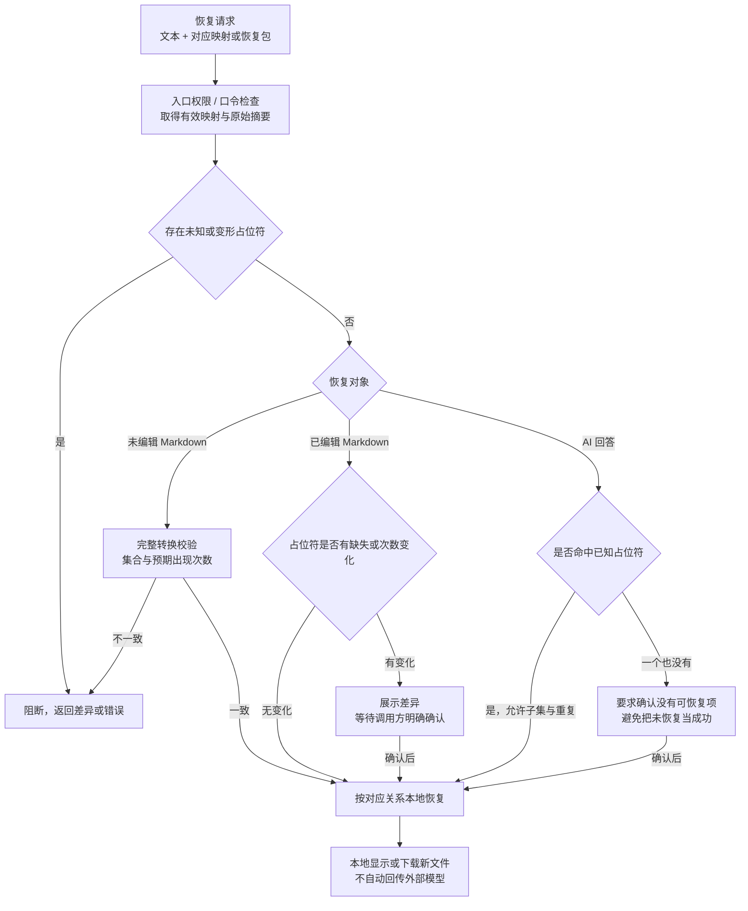
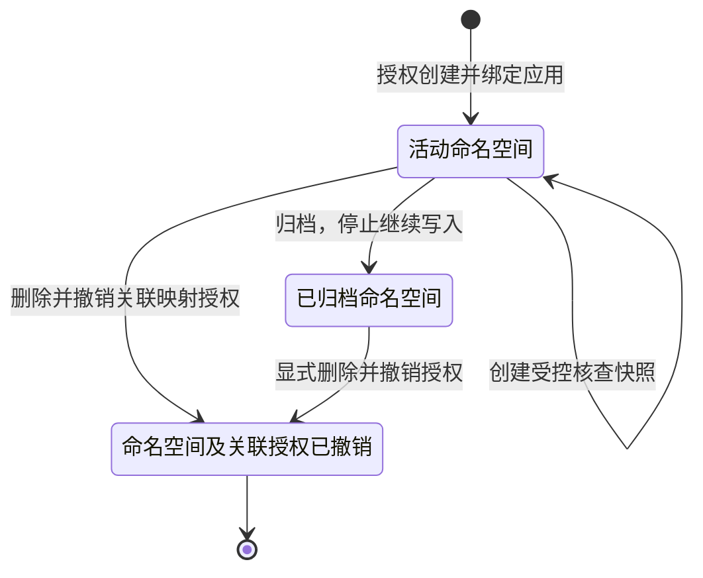

# 文本、文件、回填与映射工作流程

本文件将不同入口分开说明：它们复用核心检测能力，但授权、输出与失败处理不完全相同。总览见 [设计思路](DESIGN.md)，模块实现见 [技术架构](ARCHITECTURE.md)，代理另见 [网关配置](GATEWAY.md)。

## 1. 文本 API：检测、脱敏、可信恢复

图中恢复是之后由可信调用方另行发起的操作，不表示 API 自动把文本送给外部模型。`detect` 只返回检测信息；`redact` 返回脱敏文本与映射句柄；`refill` 需要独立恢复权限。核心 API 返回的 `egress_allowed` 与工作台残留检查不是完全相同的保证。

占位符句柄不是原值表，仍需保护；它绑定应用且受存储有效期约束。保留脱敏输出但丢失对应映射，并不能从占位符本身推导回原值。

## 2. 文件处理：先区分提取路径与原格式路径

| 关键阶段 | 实际做什么 | 失败或限制 |
| --- | --- | --- |
| 文档解析 | 提取支持的文字与结构，形成文档块和来源信息 | 不支持格式或缺少可选 PDF 依赖返回明确错误；扫描 PDF 不提供 OCR |
| Markdown 路径 | 统一段落、表格后执行可逆替换 | 不保证还原原文件的全部版式、批注或嵌入内容 |
| 应用绑定 | 绑定应用词典与版本；未知应用拒绝 | 未绑定时仅供本地预览，不能作为通过出站检查的结果 |
| 检测就绪 | 检查必需检测器和降级状态 | 必需失败直接报错；工作台对可选检测器降级也拒绝出站 |
| 出站检查 | 应用绑定、检测状态、阻断标签、残留扫描及路径附加限制 | 告警／阻断原因需要处理；`egress_allowed` 不是零漏检认证 |
| 恢复包 | 将映射作为独立的口令保护材料导出 | 恢复包不是可公开的附属文件，不要和脱敏文本一起发送给外部模型 |

文件工作台使用专用可逆策略，不是任意继承应用的无模型演示配置；绑定应用主要提供词典等上下文。原格式 DOCX 的移除嵌入对象选项属于会改变文件内容的明确选择，不能用来掩盖不支持的内容。解析警告需要阅读，不是所有警告在每个入口都会自动阻断。

实现：`document/extract.py`、`document/markdown.py`、`document/docx_patch.py`、`service/v1_documents.py`。

## 3. 回填：完整文本、已编辑文本与回答的合同不同

这张图对应 `document/refill_flow.py` 的 Markdown 与回答恢复。DOCX 恢复另走 `docx_patch.py`，API 的结构化恢复另有 JSON 结构和大小／深度限制，不能把 Markdown 的人工确认按钮套用到所有接口。

| 恢复合同或入口 | 缺少原有占位符 | 重复已知占位符 | 未知／变形占位符 |
| --- | --- | --- | --- |
| `exact_transform` | 阻断 | 提供预期次数时按次数严格检查 | 阻断 |
| `trusted_display` | 允许引用子集 | 允许 | 阻断 |
| 已编辑 Markdown | 有差异时要求确认 | 有差异时要求确认 | 阻断，确认不能覆盖这类错误 |
| AI 回答恢复 | 正常情况 | 正常情况 | 阻断；零命中另要求确认 |
| 代理自动回填 | 取决于代理模式及回填策略 | 取决于策略 | 必须核对具体响应模式；不能默认套用文件工作台规则 |

严格文件转换要求完整性，普通问答往往只提及少量实体。因此“没有重复所有输入占位符”并不天然是模型错误；选错合同会造成合法回答被拒绝。图中的确认仅对允许的差异生效，不能授权未知占位符凭空对应某个原值。

## 4. 命名空间与映射生命周期

归档不是删除，也不自动撤销已有映射授权；删除会先撤销该命名空间关联的映射句柄，再删除命名空间记录。已经导出的恢复包、已经交付给客户端的原值不会因此自动消失。核查快照也有自身的生命周期，不能把命名空间删除理解为已清除所有外部副本。

| 作用域 | 用途 | 生命周期重点 |
| --- | --- | --- |
| 单文档 | 一次处理与对应恢复 | 保留映射、摘要和预期次数，按存储 TTL 管理 |
| 会话 | 连续片段中的同一实体身份 | 会话状态、过期和进程行为需按接口核对 |
| 命名空间 | 明确关联的多轮或多段材料 | 应用绑定、身份合同、活动／归档状态和授权撤销 |

实现：`mapping.py`、`session.py`、`vault.py`、`namespace_vault.py`、`inspection.py`。此处是持有原值的数据管理流程；持久化安全与公开材料限制见 [安全边界](BOUNDARIES.md)。
